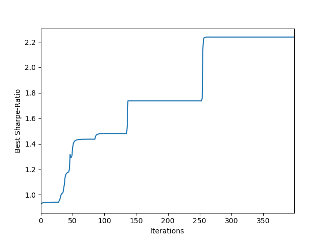
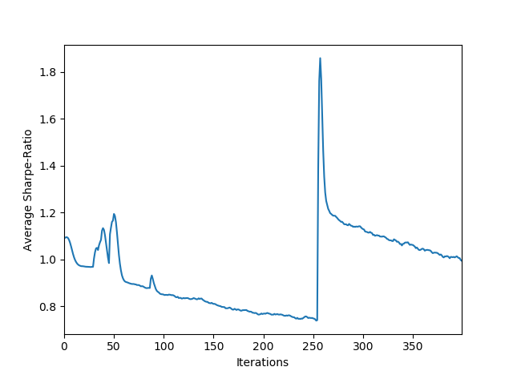
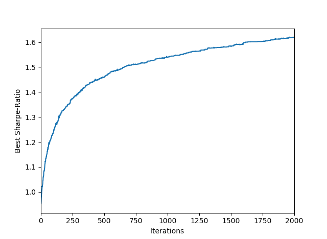

### Financial Portfolio Selection using Particle Swarm Optimization (PSO) and Genetic Algorithm (GA)

### Data Preparation

Both PSO and GA were implemented in Python on a dataset downloaded from Kaggle [https://www.kaggle.com/camnugent/sandp500/data ]. This dataset (given as S&P_data_original) consisted of 5-year historical prices data for all stocks listed on S&P 500 from 08/02/2013 – 07/02/2018. It was initially composed of data of 505 listed stocks. However, stocks that had joined the index after start of the chosen 5-year period did not have records available for all trading days during the chosen period. Records for these stocks were removed to ensure equal number of records for all stocks in the dataset. The final dataset used for implementation contained records of 470 stocks, with each stock having closing price data for all 1259 trading days in the 5-year period. Daily returns were calculated for each stock using corresponding closing prices and added to the dataset. This dataset (given as S&P_data_modified) was used to find an optimal portfolio made of 470 stocks.

### Implementation

Portfolio selection problem was thus solved in 470-dimensional search space, in which PSO and GA tried to find optimal combination of weights representing the capital allocated to all stocks in the portfolio. Each point in the search space represented a possible combination of weights and therefore, a possible portfolio. Weights representing a given portfolio along with daily returns data for all stocks were used to calculate mean return, standard deviation, and hence sharpe-ratio of that portfolio. Fitness of a combination of weights, represented by a particle’s position in PSO or an individual in GA, was evaluated by the sharpe-ratio of the resulting portfolio.

**Sharpe ratio = (Rp - Rf)/Sp**

where Rp is portfolio's mean return, Sp is the standard deviation of portfolio’s mean return and Rf  is the available rate of return of a risk-free security.

The rate of return of a risk-free security (Rf) required in calculating the sharpe-ratio was taken to be the annual interest-rate on 5-year U.S. Treasury, which was 2.57% as on 07/02/2018 [https://www.cnbc.com/quotes/?symbol=US5Y ]. The combination of weights that maximized portfolio’s sharpe-ratio was considered the fittest or optimal solution.

### Parameter settings and results of PSO

The tuning parameters of PSO are swarm-size (number of particles in the swarm), number of iterations per trial, value of inertia weight w, and values of acceleration coeffecients c1 and c2. Number of dimensions of each particle were fixed at 470 as portfolio of 470 stocks was desired. 

Particles exhibit convergence when pbest positions of all particles move closer to gbest position of the swarm and divergence when their pbest positions move away from the gbest position. As c1 controls the contribution of pbest positions and c2 controls the contribution of gbest position in the movement of particles, value of c1 should decrease and that of c2 should increase with time to decrease exploration of particles in later stages and increase the chances of convergence towards gbest position. Additionally, value of w, which controls the effect of previous velocity on present velocity, should start with a large value and decrease with time to favour exploration in initial stages and exploitation in later stages of trial runs. The time-variant forms of w, c1 and c2 were incorporated by means of the following equations:

**w(t) = ( w(0) - w(n) ) ( (n - t)/n ) + w(n)**

where w(t) is the inertia weight at iteration t, w(0) is the initial inertia weight, n is the maximum number of iterations and w(n) is the final ineria weight at the end of all iterations.

**c1(t) = ( c1(min) - c1(max) )t/n + c1(max)**

**c2(t) = ( c2(max) - c2(min) )t/n + c1(min)**

where c1(t) and c2(t) are the values of c1 and c2 at iteration t, n is the maximum number of iterations,  c1(min) and c2(min)  are the minimum values of c1 and c2 respectively, and c1(max) and c2(max) are the maximum values of c1 and c2 respectively.

The best results for PSO were achieved when swarm-size was set to 500, number of iterations per trial were set to 400, time variant forms of w, c1 and c2 were used such that w(0) was set at 0.9, w(n) was set at 0.4, c1(min) and c2(min) were set at 0.5,  and c1(max) and c2(max) were set at 2.5. The best solution achieved provided portfolio sharpe-ratio of 2.237 (See Figure 1). Good convergence of particles around gbest value was observed by using time-variant forms of w, c1 and c2 (See Figure 2). Number of iterations to optimal result was observed to be 250. Optimal results achieved by PSO:

**Optimal Portfolio Mean Return - 38.38 %**

**Optimal Portfolio Risk - 16.00 %**

**Maximized Sharpe-Ratio - 2.24**

**Figure 1.	Variation of best sharpe-ratio with iterations for PSO**

**Figure 2.	Variation of average sharpe-ratio with iterations for PSO**

### Parameter settings and results of GA

The tuning parameters of GA are population-size (number of individuals in the population), number of iterations (generations) per trial, crossover probability pc and mutation probability pm. Number of genes in each individual were fixed at 470 as portfolio of 470 stocks was desired.

In implementing GA, convergence of population towards fittest individual was observed from the very beginning of the process of tuning parameters, given that pc was kept within 0.5 and 1.0 and pm was kept less than 0.05. This was understood to be due to the implementation of simple elitism in the algorithm which ensured successive generations were fitter than the previous ones. However, the population did not converge to a final fitness value. The best values for population-size and number of iterations per trial remained elusive as every successive increase in their values would yield better results. With population-size set at 500, number of iterations per trial set at 2000, pc set at 0.85, and pm set at 0.025, the fittest individual representing optimal weights maximized the sharpe ratio to 1.62 (See Figure 3). These were not the optimal results as further improvement in results could be achieved in future generations. However, increase in number of generations increased the CPU time and results did not seem to improve significantly. Results achieved by GA till 2000 iterations per trial are:

**Optimal Portfolio Mean Return - 22.48 %**

**Optimal Portfolio Risk - 12.28 %**

**Maximized Sharpe-Ratio - 1.62**

**Figure 3.	Variation of best sharpe-ratio with iterations for GA**

### Conclusion

While parameters of PSO were difficult to tune to achieve convergence of swarm, it achieved optimal results in 250 iterations per trial. On the other hand, GA could not be tuned to achieve convergence of population towards the fittest individual even after 2000 iterations per trial. Results achieved by GA after 2000 iterations were not even close to results achieved by PSO after 250 iterations. Population-size in both cases were tuned to 500 and dimensions of search space was fixed at 470. The optimal portfolio found by PSO had sharpe-ratio of 2.24 with portfolio return at 38.38% and portfolio risk at 16.00%. On the other hand, GA could maximize portfolio’s sharpe-ratio to only 1.62 after 2000 iterations. 

In practical real-life scenario, investors would want to choose a fixed number of stocks from those listed on S&P 500 and would not want all S&P 500 stocks in a single portfolio. This would require introduction of constraint on the  number of stocks in a portfolio in the optimization problem. Many other practical constraints such as bounds on investments and transaction costs can also be introduced. Additionally, real-life portfolios could be made of assets other than stocks, such as fixed-income securities, which would require additional datasets and relevant fitness-functions to implement algorithms for portfolio optimization.  

